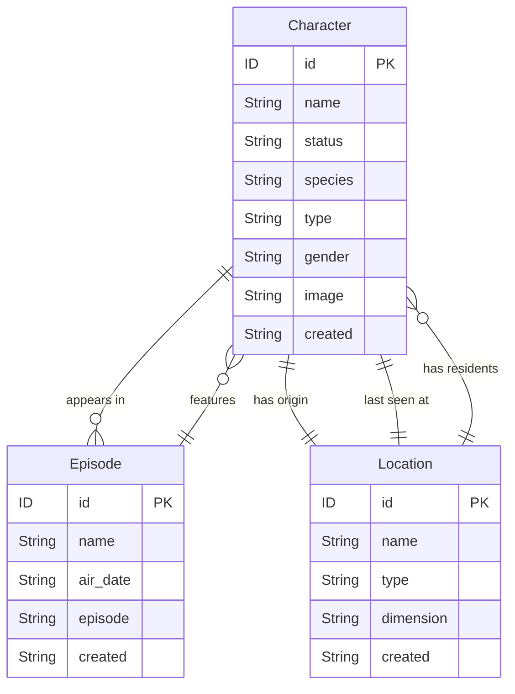

```mermaid
erDiagram
    Character ||--o{ Episode : "appears in"
    Character ||--|| Location : "has origin"
    Character ||--|| Location : "last seen at"
    Location ||--o{ Character : "has residents"
    Episode ||--o{ Character : "features"

    Character {
        ID id PK
        String name
        String status
        String species
        String type
        String gender
        String image
        String created
    }

    Episode {
        ID id PK
        String name
        String air_date
        String episode
        String created
    }

    Location {
        ID id PK
        String name
        String type
        String dimension
        String created
    }
```
